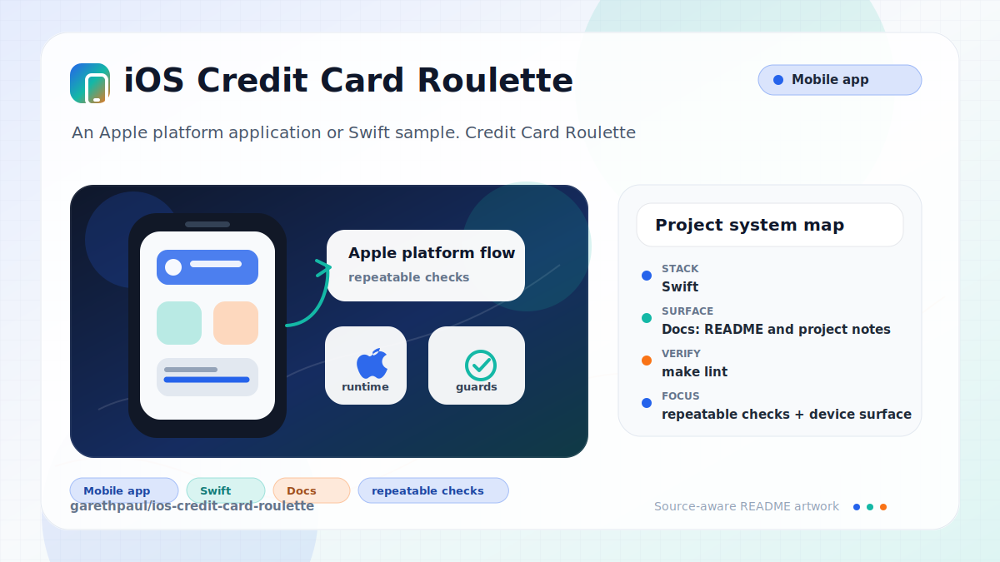

# ios-credit-card-roulette

<!-- README-OVERVIEW-IMAGE -->


## Overview

`garethpaul/ios-credit-card-roulette` is an Apple platform application or Swift sample. Credit Card Roulette

This README is based on the checked-in source, manifests, scripts, and repository metadata on the `master` branch. The project language mix found during review was: Swift (7).

## Repository Contents

- `CHANGES.md` - concise history of maintenance changes
- `README.md` - project overview and local usage notes
- `CardRoulette` - source or example code
- `CardRoulette.xcodeproj` - Xcode project file
- `CardRouletteTests` - source or example code
- `Makefile` - local verification entry point
- `SECURITY.md` - security reporting and disclosure guidance
- `scripts/check-baseline.py` - static roulette flow and privacy verifier
- `VISION.md` - project direction and maintenance guardrails

Additional scan context:

- Source directories: CardRoulette, CardRouletteTests
- Dependency and build manifests: none detected
- Entry points or build surfaces: `make check`, CardRoulette.xcodeproj
- Test-looking files: CardRouletteTests/CardRouletteTests.swift, CardRouletteTests/Info.plist

## Getting Started

### Prerequisites

- Git
- macOS with Xcode for building Apple platform projects
- Python 3 for local static verification on non-macOS hosts

### Setup

```bash
git clone https://github.com/garethpaul/ios-credit-card-roulette.git
cd ios-credit-card-roulette
make lint
make test
make build
make check
```

The checked-in project has no external dependency manifest. Use Xcode for full builds and `make check` for static verification on hosts without Xcode.

## Running or Using the Project

- Open `CardRoulette.xcodeproj` in Xcode, choose the app or sample scheme, and run it on the matching simulator/device.
- The app stores participant names only in memory for the current run.
- Participant-name normalization is shared by both entry screens and covered by focused XCTest assertions.
- Visible participant rows filter the legacy mutable array to typed entries, so
  malformed values cannot create blank or mismatched table rows.
- Participant unwind sources are checked before reading participant items.
- Winner selection filters the legacy player list down to typed participant entries before choosing a winner.
- The button and shake paths share a typed winner trigger, so invalid legacy
  entries cannot present the winner screen without an eligible participant.
- Shake handling uses UIKit's authoritative motion argument while retaining the
  typed participant gate, so a nil event cannot suppress a valid shake.
- Visible first-responder ownership acquires shake delivery when the roulette
  screen appears and relinquishes it as the screen disappears.
- Button and shake inputs share single-flight winner presentation, preventing a
  second input from queuing another winner segue during the same transition.
- Winner action availability follows typed participant additions and removals,
  so the primary button is disabled when no winner can be selected.
- Winner destination controllers are checked before winner data is assigned.
- Participant removal checks row indexes before mutating the legacy player list.
- Table rows use a fallback cell if the storyboard reuse identifier is unavailable.
- The card logo is scoped to each navigation item title view instead of being
  added as a navigation-controller overlay.
- The app does not process payments or collect credit card numbers.

## Testing and Verification

Run the local static baseline:

```bash
make lint
make test
make build
make check
```

The `lint`, `test`, and `build` targets intentionally alias the canonical baseline
on hosts without Xcode, so the standard local gate commands
stay available while preserving the single source of truth.

The baseline runs `scripts/check-baseline.py`, parses plist/storyboard/project XML, checks the Swift source inventory and testability wiring, verifies that empty participant lists cannot crash winner selection, checks shared participant-name normalization, checks unwind source handling, checks typed participant filtering for the legacy player list, checks guarded participant removal, checks winner destination handling, checks winner-screen fallback and input guards, checks table fallback cell handling, checks navigation logo title view ownership, checks invalid hex color fallback behavior, and guards against logging, persistence, network reporting, or payment-card handling.

The pinned GitHub Actions check runs `make test` on `macos-15`. It first runs
the static baseline, then compiles the unsigned Swift 5 app and executes twenty-four
participant normalization, array-safety, removal, unwind, and winner-destination
tests on an available iPhone simulator. It does not persist or upload participant
data, perform payment processing, deploy, or use signing material.

For runtime verification on macOS, launch the sample in a simulator and exercise
participant entry, removal, and winner selection without entering payment data.

GitHub Actions runs the same Python static `make check` baseline on Ubuntu for
pushes and pull requests. Full simulator and device verification remains a
macOS Xcode task.

When the required SDK or runtime is unavailable, use static checks and source review first, then verify on a machine that has the matching platform toolchain.

## Configuration and Secrets

- No required secret or credential file was identified in the repository scan. If you add integrations later, keep secrets out of git.
- Keep signing files, local xcconfig files, and environment files out of git.

## Security and Privacy Notes

- Review changes touching network requests, sockets, or service endpoints; examples from the scan include CardRoulette/Info.plist, CardRouletteTests/Info.plist.
- Review changes touching file, media, JSON, XML, CSV, OCR, or data parsing; examples from the scan include CardRoulette/AddParticipantViewController.swift, CardRoulette/Info.plist, CardRoulette/ViewController.swift, CardRoulette/WinnerViewController.swift, and 1 more.
- Participant names and payment choices should remain local-only. Do not add storage, upload, analytics, or real payment processing without a separate privacy and security design.
- Keep the typed winner trigger aligned with filtered participant selection.

## Maintenance Notes

- Every Make verification target derives the checkout root from the loaded
  Makefile, so an absolute Makefile path works from any working directory.
- This looks like an Apple platform project or sample. Xcode, Swift, CocoaPods, and deployment target versions may need to match the original project era.
- See `SECURITY.md` for vulnerability reporting and safe research guidance.
- See `VISION.md` for project direction and contribution guardrails.
- See `docs/plans/2026-06-09-unwind-source-guard.md` for the participant unwind source guardrail.
- See `docs/plans/2026-06-09-participant-array-type-guard.md` for the typed participant array guardrail.
- See `docs/plans/2026-06-09-participant-removal-index-guard.md` for the participant removal index guardrail.
- See `docs/plans/2026-06-09-navigation-logo-title-view.md` for the navigation logo title view guardrail.
- See `docs/plans/2026-06-10-winner-destination-guard.md` for the winner destination guardrail.
- See `docs/plans/2026-06-09-make-gate-aliases.md` for the local gate alias guardrail.
- See `docs/plans/2026-06-10-ci-baseline.md` for the GitHub Actions static
  baseline.
- See `docs/plans/2026-06-12-hosted-xctest.md` for the shared scheme,
  simulator discovery, and hosted XCTest gate.
- See `docs/plans/2026-06-13-typed-winner-trigger.md` for button and shake
  eligibility based on typed participants.
- See `docs/plans/2026-06-13-visible-participant-rows.md` for typed table-row
  rendering and removal across malformed legacy entries.
- Run `make lint`, `make test`, `make build`, and `make check` before pushing changes to Swift sources, plist/storyboard files, Xcode metadata, winner selection, or payment-boundary documentation.

## Contributing

Keep changes small and tied to the project that is already present in this repository. For code changes, document the toolchain used, avoid committing generated dependency directories or local configuration, and update this README when setup or verification steps change.
